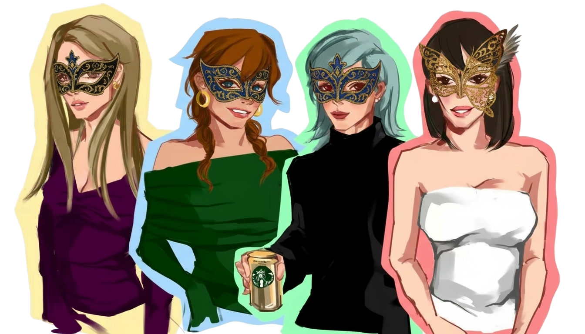
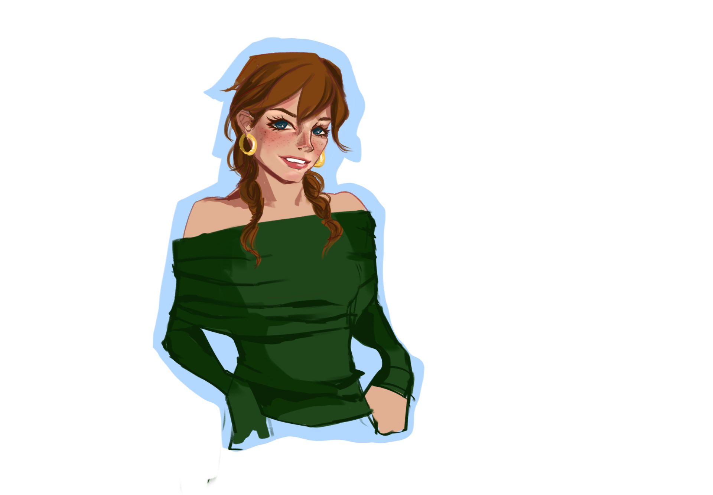
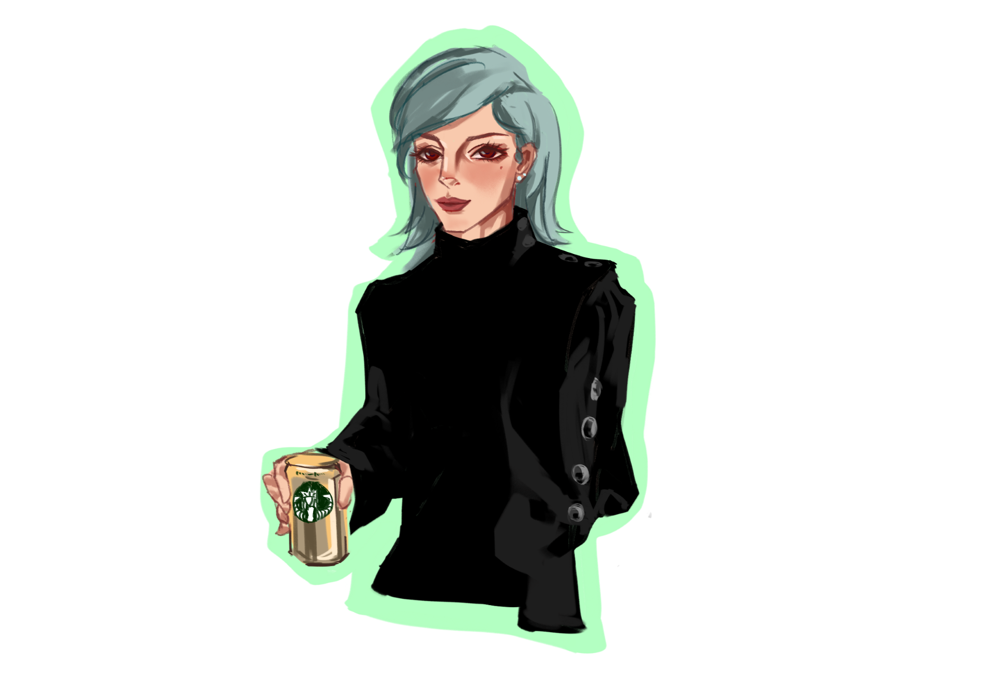
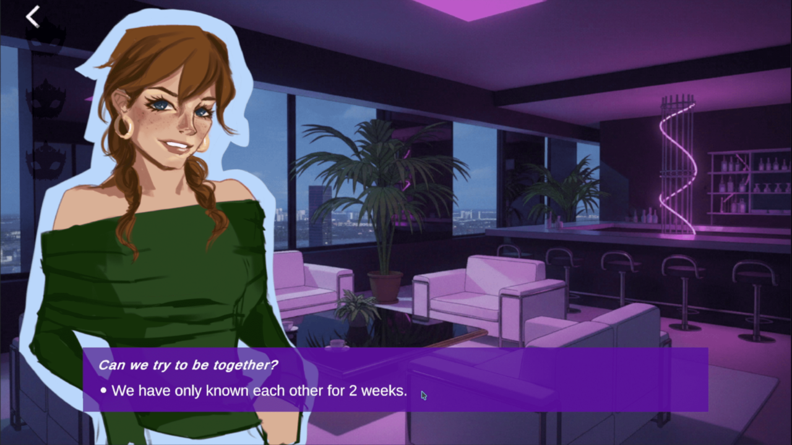

# Arcana of Want

**Arcana of Want** is a short, narrative-driven dating-sim inspired game created for **USC Games Global Game Jam 2026**.

At its core, the game explores how repeated relationship choices slowly shape who we become — not who we want to be.  
It’s about romance, but more importantly, it’s about **the emotional roles (“masks”) we perform**, often without realizing it.

🎮 **Genre:** Narrative / Visual Novel / Interactive Dialogue  
🛠 **Engine:** Unity  
💬 **Dialogue System:** Yarn Spinner  
🕒 **Playtime:** ~20–30 minutes  

---

## 🎭 Core Concept

Players believe they are freely choosing how to respond in relationships.  
In reality, every choice quietly reinforces one of three emotional **Masks**.

Over time:
- Certain responses disappear
- Emotional patterns solidify
- The ending becomes inevitable

There is **no correct ending**.  
The game is not about “winning” — it’s about **recognition**.

> *Who do you become when you keep making the same choices?*

---

## 🧠 Core Gameplay Loop

1. Read dialogue
2. Make a choice
3. Choice adds points to a hidden Mask
4. Masks subtly influence future dialogue
5. Final ending is locked by the dominant Mask

The illusion of freedom slowly gives way to emotional constraint.

---

## 🎭 The Three Masks

Each Mask represents a belief the player unconsciously adopts through repeated behavior.

### ❤️ The Simp
**Theme:** Attachment, longing, self-erasure  
**Core belief:** *“If I try harder, I’ll be chosen.”*

- Emotional over-investment
- Accepting ambiguity instead of clarity
- Reaching out even when it hurts

### 🛡 The Martyr
**Theme:** Self-sacrifice, savior complex  
**Core belief:** *“My value comes from being needed.”*

- Emotional caretaking
- Absorbing others’ pain
- Staying when you should leave

### ⚖️ The Arbiter
**Theme:** Calculation, emotional distancing  
**Core belief:** *“Feelings should be efficient and safe.”*

- Transactional relationships
- Emotional detachment
- Control over vulnerability

---

## 👥 Characters

### Kai — *The Simp Route*
- The person the player loves the most
- Reappears throughout the game
- Never fully commits, never fully leaves
- Primary source of **Simp** points

### Sylvia — *The Arbiter Route*
- Pragmatic, emotionally distant
- Relationship feels calculated and conditional
- Primary source of **Arbiter** points

### Blake — *The Martyr Route*
- Vulnerable, emotionally dependent
- Player becomes their emotional anchor
- Primary source of **Martyr** points

### Annie — *The Mirror*
- Starts as a supportive friend
- Helps the player recover from Kai
- Introduces Sylvia
- Eventually falls in love with the player
- Forces confrontation with accumulated emotional patterns

---

## 📖 Narrative Structure

### Level One — Kai Arc
- Short-lived emotional reunion
- Hope without resolution
- Kai pulls away again

### Level Two — Sylvia Arc
- Long-distance, transactional relationship
- Increasing emotional absence
- Gradual disengagement

### Level Three — Blake Arc
- Emotionally intense dependency
- Player choices determine caretaker vs boundary-setting behavior
- Relationship collapses under emotional weight

### Level Four — Final Confrontation
- Annie confesses feelings
- Player attempts one last reconnection with Kai
- Ending is selected based on the dominant Mask

---

## 🔚 Endings

The final path is **not chosen directly**.

It is automatically determined by the Mask with the highest score:

- **Simp Ending**
- **Martyr Ending**
- **Arbiter Ending**

Each ending leads into the Credits scene.

---

## 🧩 Gameplay Systems

### Mask Scoring System
- Global variables: `$simp`, `$martyr`, `$arbiter`
- Updated across all dialogue files
- Persist across scenes

### Choice Echoing
- Player choices are echoed back as dialogue
- Ensures consistent narrative flow and UI behavior

### Scene Transitions
- All scene changes are handled through Yarn commands:
<<load_scene “SceneName” “StartNode”>>

---

## 🛠 Technical Architecture

### Yarn Spinner Integration
- Single shared `InMemoryVariableStorage`
- Variables persist across scenes
- Dialogue auto-start disabled to ensure correct initialization

### Key Runtime Scripts

**YarnSceneLoader**
- Registers `load_scene` Yarn command
- Maintains global variable storage
- Rebuilds DialogueRunner on scene load

**CharacterManager**
- Handles `show_character`, `hide_character`, `hide_all_characters`
- Controls visual emphasis and dimming

**BackgroundManager**
- Manages background sprite changes
- Supports crossfading transitions

**MaskOverlayHighlighter**
- Visually highlights the dominant Mask
- Reacts dynamically to variable changes

### UI & Input
- Click-anywhere-to-continue
- Optional auto-advance mode
- Menu navigation and quit handling

### Audio
- Persistent `AudioManager` singleton
- Maintains continuity across scenes

---

## 🗂 Project Structure

### Scenes
- Main Menu
- PhoneChat / PhoneChatLevelTwo / PhoneChatLevelThree
- LevelOne / LevelTwo / LevelThree / LevelFour
- Credit Menu

### Dialogue Files
- `LevelOneDia.yarn`
- `LevelTwoDia.yarn`
- `LevelThreeDia.yarn`
- `LevelFourDia.yarn`

---

## 🎯 Design Philosophy

- No optimal playstyle
- No “best girl” outcome
- No redemption through a single choice

The game asks players to sit with discomfort, recognize patterns,  
and reflect on how identity forms through repetition.

---

## 📽 Demo

▶ **Gameplay Demo:**  
https://youtu.be/V82LnK6Av2c

---

## 👨‍👩‍👧 Team

**Team 06 — USC Games Global Game Jam 2026**

- [Skylar (Yining) Deng](https://github.com/ydeng053-ux0)
- [Sahil Gujral](https://github.com/ZackAboy)
